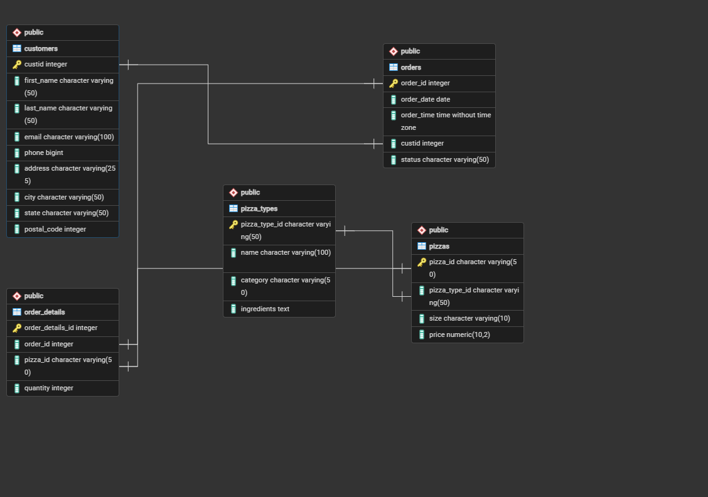
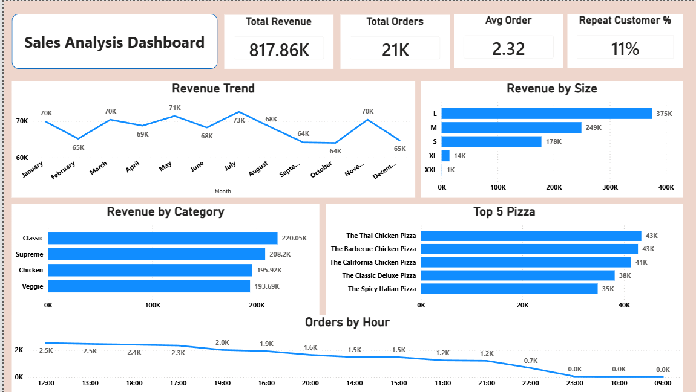

# Pizza Sales Analysis using PostgreSQL & Power BI

A complete end-to-end data analytics project where raw pizza sales data was cleaned, analyzed using PostgreSQL, and visualized in Power BI to generate actionable business insights.

---

# Project Overview

The objective of this project is to analyze pizza sales data to answer real-world business questions such as:

- Which pizza category generates the highest revenue?
- What are the peak order hours?
- Which pizzas are top-selling?
- Which pizza sizes are most popular?
- Monthly sales trends
- Revenue contribution by category
- Customer ordering behavior

The project follows the complete Data Analytics workflow:

> Data Collection → Data Cleaning → Database Design → SQL Analysis → Business Insights → Power BI Dashboard

---

# Project Objectives

- Clean and prepare raw sales data
- Design a relational database
- Perform SQL-based business analysis
- Create reusable SQL Views
- Build an interactive Power BI dashboard
- Present key business insights

---

# Tools & Technologies

| Tool | Purpose |
|------|---------|
| PostgreSQL | Database & SQL Analysis |
| SQL | Data Cleaning & Business Queries |
| Power BI | Dashboard & Visualization |
| Git | Version Control |
| GitHub | Portfolio & Project Hosting |

---

# Project Structure

```
pizza-sales-analysis/
│
├── Dataset/
│   └── pizza_sales.csv
│
├── SQL/
│   ├── Create_DB.sql
│   ├── Schema_design.sql
│   ├── Data_Cleaning.sql
│   ├── Create_Views.sql
│   └── Solve_Business_Questions.sql
│
├── PowerBI/
│   └── Pizza_Sales_Dashboard.pbix
│
├── Images/
│   ├── dashboard.png
│   └── schema.png
│
├── README.md
└── LICENSE
```

---

# Database Schema

The database was designed using a normalized relational schema to ensure data consistency, eliminate redundancy, and improve query performance.

### Main Tables

- Orders
- Order Details
- Pizzas
- Pizza Types

### Schema Diagram



---


# Data Cleaning

The dataset was cleaned using SQL before analysis.

Cleaning tasks included:

- Removing duplicates
- Handling NULL values
- Data type conversion
- Standardizing column values
- Data validation


# Business Questions Solved

Examples of analysis performed:

- Total Revenue
- Total Orders
- Average Order Value
- Average Pizzas per Order
- Best Selling Pizza
- Worst Selling Pizza
- Revenue by Category
- Revenue by Pizza Size
- Hourly Sales Trend
- Daily Sales Trend
- Monthly Revenue Trend
- Top 5 Pizzas by Revenue
- Bottom 5 Pizzas by Revenue
- Revenue Contribution (%)
- Running Total Revenue
- Rank Products by Sales

Total SQL Business Questions Solved: **20+**


# SQL Views

To simplify reporting, reusable SQL Views were created for key KPIs.

Examples:

- vw_total_sales
- vw_monthly_sales
- vw_category_sales
- vw_hourly_sales
- vw_top_pizzas
- vw_bottom_pizzas


# Power BI Dashboard

The dashboard includes:

- KPI Cards
- Revenue Trend
- Monthly Sales
- Hourly Orders
- Daily Orders
- Category Performance
- Pizza Size Distribution
- Top & Bottom Selling Pizzas
- Interactive Filters
- Dynamic Visualizations

---

## Dashboard Preview

> *(Replace with your dashboard screenshot)*

```md

```

---

# Key Business Insights

Some insights discovered from the analysis:

- Classic pizzas generated the highest revenue.
- Large-size pizzas were the most frequently ordered.
- Sales peaked during lunch and evening hours.
- Weekend sales were higher than weekdays.
- A small number of pizzas contributed a large portion of total revenue.

---

# Skills Demonstrated

- SQL
- PostgreSQL
- Data Cleaning
- Database Design
- Query Optimization
- SQL Views
- Window Functions
- Aggregate Functions
- CTE
- Joins
- Business Analysis
- Data Visualization
- Power BI
- Git
- GitHub

---

# How to Run This Project

1. Clone this repository.

```bash
git clone https://github.com/your-username/pizza-sales-analysis.git
```

2. Create the PostgreSQL database.

3. Execute SQL files in the following order:

- Create_DB.sql
- Schema_design.sql
- Data_Cleaning.sql
- Create_Views.sql
- Solve_Business_Questions.sql

4. Open the Power BI dashboard (Report_power_bi.pbix).

---

# Screenshots

### Dashboard

```md

```

### Database Schema

```md

```

---

# Learning Outcomes

This project helped strengthen practical skills in:

- Writing complex SQL queries
- Solving business problems using SQL
- Designing relational databases
- Building interactive dashboards
- Performing data analysis
- Using Git & GitHub for version control

---

# Author

**Md Naim Uddin**

Computer Science & Engineering Student

Aspiring Data Analyst | BI Engineer | Data Engineer

GitHub: https://github.com/naim5641

LinkedIn: https://www.linkedin.com/in/md-naim-uddin-279896275/

---

# If you found this project helpful, consider giving it a Star!
